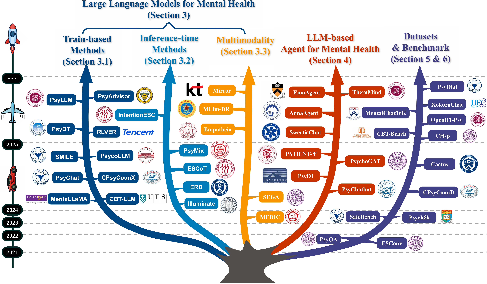
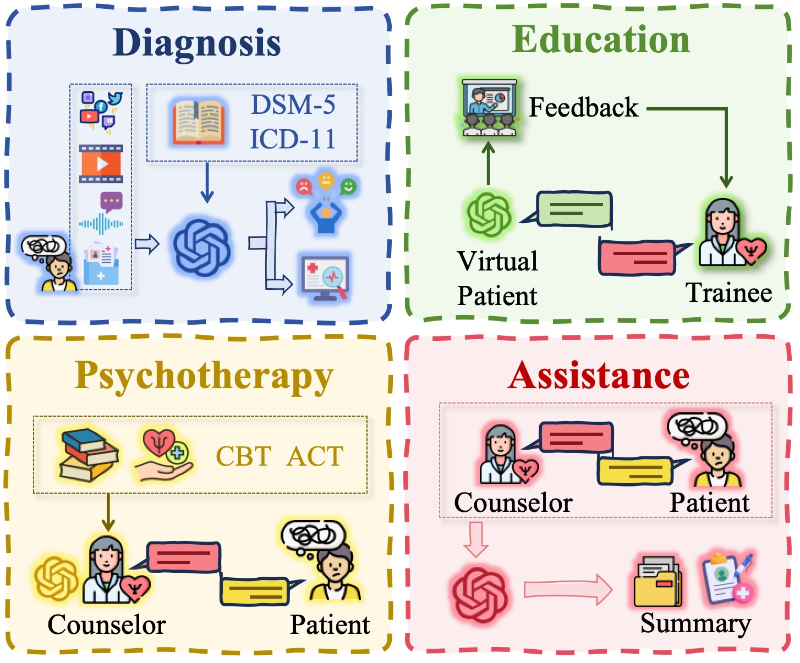
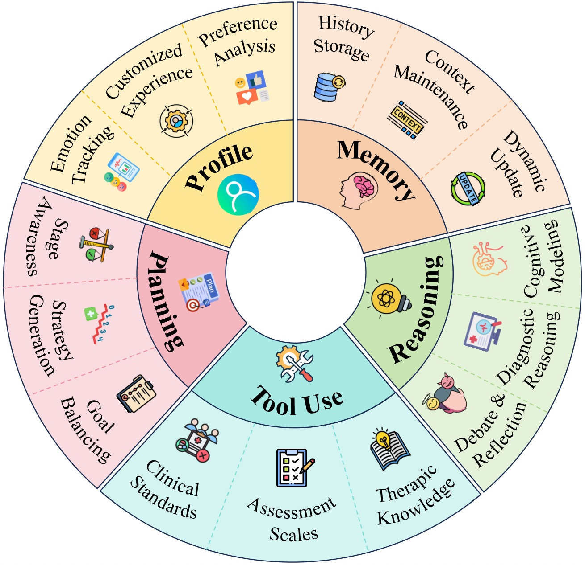
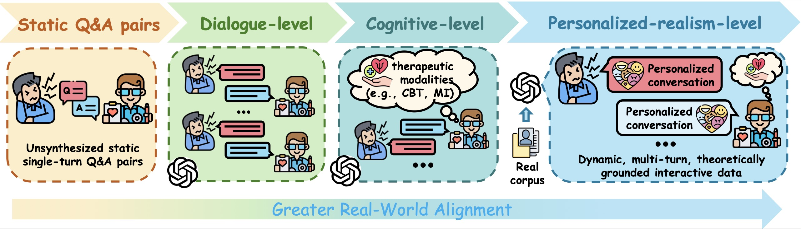

<h1 align="center" style="font-size: 52px; font-weight: 600; font-family: 'Palatino Linotype', 'Book Antiqua', serif;">
💛 Awesome-Mental-Health-LLMs 💛
</h1>

✨ You can click on 👀 <b>Watch</b> and ⭐ <b>Star</b>  
to support the Awesome-Mental-Health-LLMs project ✨

 

  <i>“The greatest discovery of my generation is that a human being can alter his life by altering his attitudes.”</i>
   
  — <b>William James</b>

&nbsp;

 
<em>Figure: A visualization of the development trajectory of LLM-based mental health implementations from 2021 to 2025.</em>

## LLM Applications in Mental Health Care 

 
   

## Core components of a mental health LLM agent 

 
 

.

## Data Synthesis: From Dialogue-level to Personalized-realism-level

  

## 1. Large Language Models for mental health 
### 1.1 Core Methodologies for Model Adaptation
- (*Arxiv'25*) Beyond Empathy: Integrating Diagnostic and Therapeutic Reasoning with Large Language Models for Mental Health Counseling  [[📝 Paper](https://arxiv.org/abs/2505.15715)] [[💻 Code](https://github.com/Emo-gml/PsyLLM)]
- (*Arxiv'25*) Why Pre-trained Models Fail: Feature Entanglement in Multi-modal Depression Detection [[📝 Paper](https://arxiv.org/abs/2503.06620)] 
- (*Arxiv'25*) ProMind-LLM: Proactive Mental Health Care via Causal Reasoning with Sensor Data [[📝 Paper](https://arxiv.org/abs/2505.14038)]
- (*Arxiv'25*) PsycoLLM: Enhancing LLM for Psychological Understanding and Evaluation [[📝 Paper](https://arxiv.org/abs/2407.05721)] [[💻 Code](https://github.com/MindIntLab-HFUT/PsycoLLM)]
- (*Arxiv'24*) Interactive Agents: Simulating Counselor-Client Psychological Counseling via Role-Playing LLM-to-LLM Interactions [[📝 Paper](https://arxiv.org/abs/2408.15787)] [[💻 Code](https://github.com/qiuhuachuan/interactive-agents)]
- (*Arxiv'25*) Fine-Tuning Open-Weight Language Models to Deliver Cognitive Behavioral Therapy for Depression: A Feasibility Study [[📝 Paper](https://arxiv.org/abs/2412.00251v2)]
- (*lrec'24*) CBT-LLM: A Chinese Large Language Model for Cognitive Behavioral Therapy-based Mental Health Question Answering [[📝 Paper](https://arxiv.org/abs/2403.16008)] [[💻 Code](https://huggingface.co/Hongbin37/CBT-LLM)]
- (*EMNLP'25*) Reframe Your Life Story: Interactive Narrative Therapist and Innovative Moment Assessment with Large Language Models [[📝 Paper](https://arxiv.org/abs/2507.20241)]
- (*Arxiv'24*) Socratic Reasoning Improves Positive Text Rewriting [[📝 Paper](https://arxiv.org/pdf/2403.03029)]
- (*EMNLP'24*) SMILE: Single-turn to Multi-turn Inclusive Language Expansion via ChatGPT for Mental Health Support [[📝 Paper](https://arxiv.org/abs/2305.00450)] [[💻 Code](https://github.com/qiuhuachuan/smile)]
- (*COLING'25*) SweetieChat: A Strategy-Enhanced Role-playing Framework for Diverse Scenarios Handling Emotional Support Agent [[📝 Paper](https://arxiv.org/abs/2412.08389)]
- (*Arxiv'24*) MentalGLM Series: Explainable Large Language Models for Mental Health Analysis on Chinese Social Media [[📝 Paper](https://arxiv.org/abs/2410.10323)] [[💻 Code](https://github.com/zwzzzQAQ/MentalGLM)]
- (*Arxiv'24*) Emotional Support with LLM-based Empathetic Dialogue Generation [[📝 Paper](https://arxiv.org/abs/2507.12820)]
- (*Arxiv'25*) FedMentalCare: Towards Privacy-Preserving Fine-Tuned LLMs to Analyze Mental Health Status Using Federated Learning Framework [[📝 Paper](https://arxiv.org/abs/2503.05786)]
-  (*Arxiv'25*) DepressLLM: Interpretable domain-adapted language model for depression detection from real-world narratives [[📝 Paper](https://arxiv.org/abs/2508.08591)]
-  (*Arxiv'25*) PsyLite Technical Report [[📝 Paper](https://arxiv.org/abs/2506.21536)] [[💻 Code](https://github.com/Jundifang/PsyLite)]
-  (*Arxiv'25*) Enhancing Large Language Models for Detecting Mental Manipulation via Annotation-Free Data Augmentation and Anti-Curriculum Distillation [[📝 Paper](https://arxiv.org/abs/2505.15255)]
-  (*EMNLP'24*) PsyGUARD: An Automated System for Suicide Detection and Risk Assessment in Psychological Counseling [[📝 Paper]( https://aclanthology.org/2024.emnlp-main.264/)] [[💻 Code](https://github.com/qiuhuachuan/PsyGUARD)]
-  (*Arxiv'25*) Speech as a Multimodal Digital Phenotype for Multi-Task LLM-based Mental Health Prediction [[📝 Paper]( https://arxiv.org/abs/2505.23822)]
-  (*WWW'24*) MentaLLaMA: Interpretable Mental Health Analysis on Social Media with Large Language Models [[📝 Paper]( https://arxiv.org/abs/2309.13567)]
-  (*CSCWD'24*) PsyChat: A Client-Centric Dialogue System for Mental Health Support [[📝 Paper](https://arxiv.org/abs/2312.04262)]
-  (*Arxiv'24*) We Care: Multimodal Depression Detection and Knowledge Infused Mental Health Therapeutic Response Generation [[📝 Paper](https://arxiv.org/abs/2406.10561)]
-  (*Arxiv'25*) From Reddit to Generative AI: Evaluating Large Language Models for Anxiety Support Fine-tuned on Social Media Data [[📝 Paper](https://arxiv.org/abs/2505.18464)]
-  (*Arxiv'25*) RLVER: Reinforcement Learning with Verifiable Emotion Rewards for Empathetic Agents [[📝 Paper](https://arxiv.org/abs/2507.03112)]
-  (*Arxiv'24*) ETowards Open-Ended Emotional Support Conversations in LLMs via Reinforcement Learning with Future-Oriented Rewards [[📝 Paper](https://arxiv.org/abs/2508.12935)]
-  (*Arxiv'24*) COMPEER: Controllable Empathetic Reinforcement Reasoning for Emotional Support Conversation [[📝 Paper](https://www.arxiv.org/abs/2508.09521)]
-  (*AAAI'25*) MCTSr-Zero: Self-Reflective Psychological Counseling Dialogues Generation via Principles and Adaptive Exploration [[📝 Paper](https://arxiv.org/abs/2410.07129)] [[💻 Code](https://github.com/JianChengXingYun/Mctsr-Zero)]
-  (*Arxiv'25*) From Stimuli to Minds: Enhancing Psychological Reasoning in LLMs via Bilateral Reinforcement Learning
 [[📝 Paper](https://arxiv.org/abs/2508.02458)]
-  (*Arxiv'25*) Preference Learning Unlocks LLMs' Psycho-Counseling Skills [[📝 Paper](https://arxiv.org/abs/2502.19731)] [[💻 Code](https://huggingface.co/Psychotherapy-LLM)]
-  (*Arxiv'25*) WundtGPT: Shaping Large Language Models To Be An Empathetic, Proactive Psychologist [[📝 Paper](https://arxiv.org/abs/2406.15474)] [[💻 Code](https://huggingface.co/CCCCCCCCY/WundtLLaMA)]
-  (*Arxiv'25*) Psyche-R1: Towards Reliable Psychological LLMs through Unified Empathy, Expertise, and Reasoning [[📝 Paper](https://arxiv.org/abs/2508.10848)]
### 2.2 Inference-Time Strategies for Eliciting Clinical Reasoning
-  (*Arxiv'25*) Zero-shot Explainable Mental Health Analysis on Social Media by Incorporating Mental Scales [[📝 Paper](https://arxiv.org/abs/2508.10848)]
-  (*Arxiv'25*) A Systematic Evaluation of LLM Strategies for Mental Health Text Analysis: Fine-tuning vs. Prompt Engineering vs. RAG [[📝 Paper](https://arxiv.org/abs/2503.24307)]
-  (*Arxiv'24*) Illuminate: A novel approach for depression detection with explainable analysis and proactive therapy using prompt engineering [[📝 Paper](https://arxiv.org/abs/2402.05127)]
-  (*Arxiv'25*) Mental-LLM: Leveraging Large Language Models for Mental Health Prediction via Online Text Data [[📝 Paper](https://arxiv.org/abs/2508.10848)]
-  (*Arxiv'23*) Mixed Chain-of-Psychotherapies for Emotional Support Chatbot [[📝 Paper](https://arxiv.org/abs/2307.14385)]
-  (*clinicalnlp'24*) ERD: A Framework for Improving LLM Reasoning for Cognitive Distortion Classification [[📝 Paper](https://arxiv.org/abs/2403.14255)]
-  (*Arxiv'25*) MADP: Multi-Agent Deductive Planning for Enhanced Cognitive-Behavioral Mental Health Question Answer [[📝 Paper](https://arxiv.org/abs/2501.15826)]
-  (*Arxiv'25*) Psy-Copilot: Visual Chain of Thought for Counseling [[📝 Paper](https://arxiv.org/abs/2503.03645)] [[💻 Code](https://ckqqqq.github.io/Demo/Psy-Copilot/)]
-  (*Arxiv'24*) Understanding the Therapeutic Relationship between Counselors and Clients in Online Text-based Counseling using LLMs [[📝 Paper](https://arxiv.org/abs/2402.11958)]
-  (*Arxiv'25*) In-context learning capabilities of Large Language Models to detect suicide risk among adolescents from speech transcripts [[📝 Paper](https://arxiv.org/abs/2505.20491)]
-  (*clpsych'24*) Extracting and Summarizing Evidence of Suicidal Ideation in Social Media Contents Using Large Language Models [[📝 Paper](https://aclanthology.org/2024.clpsych-1.20/)]
-  (*Arxiv'25*) Development and Evaluation of HopeBot: an LLM-based chatbot for structured and interactive PHQ-9 depression screening [[📝 Paper](https://arxiv.org/abs/2507.05984)]
-  (*iwsds'25*) A Chatbot for Providing Suicide Prevention Information in Spanish [[📝 Paper](https://aclanthology.org/2025.iwsds-1.21/)]
-  (*Arxiv'24*) SouLLMate: An Application Enhancing Diverse Mental Health Support with Adaptive LLMs, Prompt Engineering, and RAG Techniques [[📝 Paper (https://arxiv.org/abs/2410.16322/)]
-  (*Arxiv'24*) Are LLMs effective psychological assessors? Leveraging adaptive RAG for interpretable mental health screening through psychometric practice [[📝 Paper](https://aclanthology.org/2025.clpsych-1.23/)]
-  (*Arxiv'24*) Retrieval-Enhanced Mental Health Assessment: Capturing Self-State Dynamics from Social Media Using In-Context Learning [[📝 Paper](https://aclanthology.org/2024.clpsych-1.20/)]
-  (*Arxiv'24*) STAMPsy: Towards SpatioTemporal-Aware Mixed-Type Dialogues for Psychological Counseling [[📝 Paper](https://arxiv.org/abs/2412.16674/)]
-  (*Arxiv'25*) SpeechT-RAG: Reliable Depression Detection in LLMs with Retrieval-Augmented Generation Using Speech Timing Information [[📝 Paper](https://arxiv.org/abs/2502.10950/)]
-  (*Arxiv'25*) Utilizing Large Language Models to Identify Evidence of Suicidality Risk through Analysis of Emotionally Charged Posts [[📝 Paper](https://aclanthology.org/2024.clpsych-1.26/)]
### 3.3 Beyond Text: Integrating Multimodal Cues
-  (*NAACL'24*) Depression Detection in Clinical Interviews with LLM-Empowered Structural Element Graph [[📝 Paper](https://aclanthology.org/2024.naacl-long.452/)]
-  (*Arxiv'25*) MLlm-DR: Towards Explainable Depression Recognition with MultiModal Large Language Models [[📝 Paper](https://arxiv.org/abs/2507.05591/)]
-  (*ICLR’25*) IT HEARS, IT SEES TOO: MULTI-MODAL LLM FOR DEPRESSION DETECTION BY INTEGRATING VISUAL UNDERSTANDING INTO AUDIO LANGUAGE MODELS [[📝 Paper](https://openreview.net/pdf?id=KA9StC9l3T/)]
-  (*MM'24*) PanoSent: A Panoptic Sextuple Extraction Benchmark for Multimodal Conversational Aspect-based Sentiment Analysis [[📝 Paper](https://arxiv.org/abs/2408.09481/)]
-  (*TMM'24*)  Towards Multimodal Emotional Support Conversation Systems [[📝 Paper](https://arxiv.org/abs/2408.03650)] [[💻 Code](https://github.com/chuyq/MESC/?tab=readme-ov-file)]
-  (*Coling'25*) Integrating Visual Modalities with Large Language Models for Mental Health Support [[📝 Paper](https://aclanthology.org/2025.coling-main.599/)]
-  (*EMNLP'25*) MIRROR: Multimodal Cognitive Reframing Therapy for Rolling with Resistance [[📝 Paper](https://arxiv.org/abs/2502.04976/)] [[💻 Code](
https://github.com/nobel-postech/mirror)]
-  (*NAACL'25*) Multimodal Cognitive Reframing Therapy via Multi-hop Psychotherapeutic Reasoning [[📝 Paper](https://arxiv.org/abs/2502.06873/))] [[💻 Code](https://github.com/nobel-postech/M2CoSC)]

## 2. LLM-Based Agents
### 2.1 Enhancing Longitudinal Engagement and Personalization
- (*Arxiv'25*) TheraMind: A Strategic and Adaptive Agent for Longitudinal Psychological Counseling [[📝 Paper](https://arxiv.org/abs/2510.25758)] [[💻 Code](https://github.com/Emo-gml/TheraMind)]
- (*Arxiv'25*) Psychological Counseling Cannot Be Achieved Overnight: Automated Psychological Counseling Through Multi-Session Conversations [[📝 Paper](https://arxiv.org/abs/2506.06626)] 
- (*AAAI'24*) MemoryBank: Enhancing Large Language Models with Long-Term Memory [[📝 Paper](https://arxiv.org/abs/2305.10250)] [[💻 Code](https://github.com/zhongwanjun/MemoryBank-SiliconFriend)]
- (*ACL'25*) AnnaAgent: Dynamic Evolution Agent System with Multi-Session Memory for Realistic Seeker Simulation [[📝 Paper](https://aclanthology.org/2025.findings-acl.1192/)] [[💻 Code](https://github.com/sci-m-wang/AnnaAgent)]
- (*Arxiv'24*) Depression Diagnosis Dialogue Simulation: Self-improving Psychiatrist with Tertiary Memory [[📝 Paper](https://arxiv.org/abs/2409.15084)]
- (*Arxiv'24*) Advancing Conversational Psychotherapy: Integrating Privacy, Dual-Memory, and Domain Expertise with Large Language Models [[📝 Paper](https://arxiv.org/abs/2412.02987)]
- (*Arxiv'25*) CA+: Cognition Augmented Counselor Agent Framework for Long-term Dynamic Client Engagement [[📝 Paper](https://arxiv.org/abs/2503.21365)]
- (*ACL'25*) iPET: An Interactive Emotional Companion Dialogue System with LLM-Powered Virtual Pet World Simulation [[📝 Paper](https://aclanthology.org/2025.acl-demo.40/)]
### 2.2 Integrating Clinical Frameworks and Therapeutic Modalities
- (*EMNLP'24*) Cactus: Towards Psychological Counseling Conversations using Cognitive Behavioral Theory [[📝 Paper](https://aclanthology.org/2024.findings-emnlp.832/)] [[💻 Code](https://github.com/coding-groot/cactus)]
- (*ACM Trans'24*) PsyChatbot: A Psychological Counseling Agent Towards Depressed Chinese Population Based on Cognitive Behavioural Therapy [[📝 Paper](https://dl.acm.org/doi/10.1145/3676962)]
- (*NAACL'25*) KMI: A Dataset of Korean Motivational Interviewing Dialogues for Psychotherapy [[📝 Paper](https://aclanthology.org/2025.naacl-long.541/)] [[💻 Code](https://github.com/hjkim811/KMI)]
- (*Arxiv'25*) Spiritual-LLM : Gita Inspired Mental Health Therapy In the Era of LLMs [[📝 Paper](https://www.arxiv.org/abs/2506.19185)] [[💻 Code](https://github.com/hjkim811/KMI)]
- (*EMNLP'25*) Reframe Your Life Story: Interactive Narrative Therapist and Innovative Moment Assessment with Large Language Models [[📝 Paper](https://aclanthology.org/2025.emnlp-main.1245/)] [[💻 Code]( https://github.com/MIMIFY/narrative-therapy-llm)]
- (*ACL'25*) CAMI: A Counselor Agent Supporting Motivational Interviewing through State Inference and Topic Exploration [[📝 Paper](https://aclanthology.org/2025.naacl-long.541/)] [[💻 Code](https://github.com/IzzetYoung/CAMI)]
- (*Arxiv'25*) AutoCBT: An Autonomous Multi-agent Framework for Cognitive Behavioral Therapy in Psychological Counseling [[📝 Paper](https://arxiv.org/abs/2501.09426)] 
- (*ACL'25*) MAGI: Multi-Agent Guided Interview for Psychiatric Assessment [[📝 Paper](https://aclanthology.org/2025.findings-acl.1278/)] [[💻 Code](https://github.com/IzzetYoung/CAMI)]
- (*Arxiv'24*) COCOA: CBT-based Conversational Counseling Agent using Memory Specialized in Cognitive Distortions and Dynamic Prompt [[📝 Paper](https://arxiv.org/abs/2402.17546)]
- (*clinicalnlp'24*) ERD: A Framework for Improving LLM Reasoning for Cognitive Distortion Classification [[📝 Paper](https://aclanthology.org/2024.clinicalnlp-1.25/)] 
- (*Arxiv'25*) MADP: Multi-Agent Deductive Planning for Enhanced Cognitive-Behavioral Mental Health Question Answer [[📝 Paper](https://arxiv.org/abs/2501.15826)] 
- (*CLPsych'25*) AutoPsyC: Automatic Recognition of Psychodynamic Conflicts from Semi-structured Interviews with Large Language Models [[📝 Paper](https://aclanthology.org/2025.clpsych-1.2/)] [[💻 Code](https://git.opendfki.de/philipp.mueller/autopsyc)]
- (*Arxiv'24*) Mixed Chain-of-Psychotherapies for Emotional Support Chatbot [[📝 Paper](https://arxiv.org/abs/2409.19533)] 
### 2.3 Leveraging Multi-Agent Architectures for Complex Reasoning and Interaction
- (*Arxiv'25*) MentalAgora: A Gateway to Advanced Personalized Care in Mental Health through Multi-Agent Debating and Attribute Control [[📝 Paper](https://arxiv.org/abs/2407.02736)] [[💻 Code]( https://github.com/jennylee03/MentalAgora)]
- (*Arxiv'25*) Wisemind: Recontextualizing ai with a knowledge-guided, theory-informed multi-agent framework for instrumental and humanistic benefits. [[📝 Paper](https://arxiv.org/abs/2502.20689)] 
- (*Arxiv'25*) MoodAngels: A Retrieval-augmented Multi-agent Framework for Psychiatry Diagnosis [[📝 Paper](https://arxiv.org/abs/2506.03750)] 
- (*EMNLP'25*) MIND: Towards Immersive Psychological Healing with Multi-Agent Inner Dialogue [[📝 Paper](https://aclanthology.org/2025.findings-emnlp.499/)] 
- (*Arxiv'25*) Supporting Construction Worker Well-Being with a Multi-Agent Conversational AI System [[📝 Paper](https://arxiv.org/abs/2506.07997)] 
### 2.4 Ensuring Safety, Reliability, and Responsible Development
- (*EMNLP'25*) EmoAgent: Assessing and Safeguarding Human-AI Interaction for Mental Health Safety [[📝 Paper](https://aclanthology.org/2025.emnlp-main.594/)] 
- (*Arxiv'25*) PsyLite Technical Report [[📝 Paper](https://arxiv.org/abs/2506.21536)] [[💻 Code](https://github.com/Jundifang/PsyLite)]
- (*Arxiv'25*) RHealthTwin: Towards Responsible and Multimodal Digital Twins for Personalized Well-being [[📝 Paper](https://arxiv.org/abs/2506.08486)] [[💻 Code](https://github.com/turna1/ResponsibleHealthTwin-RHT-)]
- (*Arxiv'25*) Ψ-Arena: Interactive Assessment and Optimization of LLM-based Psychological Counselors with Tripartite Feedback [[📝 Paper](https://arxiv.org/abs/2505.03293)]
- (*Arxiv'25*) Psy-Insight: Explainable Multi-turn Bilingual Dataset for Mental Health Counseling [[📝 Paper](https://arxiv.org/abs/2503.03607)] [[💻 Code](
https://ckqqqq.github.io/Demo/Psy-Insight/)]
- (*Arxiv'25*) Development and Evaluation of HopeBot: an LLM-based chatbot for structured and interactive PHQ-9 depression screening [[📝 Paper](https://arxiv.org/abs/2507.05984)]
- (*EMNLP'24*) PATIENT-𝜓: Using Large Language Models to Simulate Patients for Training Mental Health Professionals [[📝 Paper](https://aclanthology.org/2024.emnlp-main.711/)] [[💻 Code](https://github.com/ruiyiw/patient-psi)]
- (*EMNLP'24*) Roleplay-doh: Enabling Domain-Experts to Create LLM-simulated Patients via Eliciting and Adhering to Principles [[📝 Paper](https://aclanthology.org/2024.emnlp-main.591/)] [[💻 Code](https://roleplay-doh.github.io/)]
- (*Arxiv'25*) Modeling Challenging Patient Interactions: LLMs for Medical Communication Training [[📝 Paper](https://arxiv.org/abs/2503.22250)]
- (*ACL'24*) Multi-Level Feedback Generation with Large Language Models for Empowering Novice Peer Counselors [[📝 Paper](https://aclanthology.org/2024.acl-long.227/)] [[💻 Code]( https://github.com/SALTNLP/counseling-feedback)]

## 3. Dataset 
### 3.1 Mental Health Dialogue Data Construction and Synthesis
| Dataset | Year | Description | Source |
|------|------|---------|-------------|
| EmpatheticDialogues | 2018.11 | A dialogue dataset for empathy and emotional conversations | (*ACL'19*) Towards Empathetic Open-domain Conversation Models: a New Benchmark and Dataset [[📝 Paper](https://aclanthology.org/P19-1534/)] [[💻 Code](https://github.com/facebookresearch/EmpatheticDialogues)] |
| PsyQA | 2021.6 | A high-quality manually annotated Chinese mental health QA dataset | (*Findings'21*) PsyQA: A Chinese Dataset for Generating Long Counseling Text for Mental Health Support [[📝 Paper](https://aclanthology.org/2021.findings-acl.130/)] [[💻 Code](https://github.com/thu-coai/PsyQA)] |
| ESConv | 2021.8 | A high-quality, multi-turn, strategy-annotated dataset of emotionally supported conversations | (*IJCNLP'21*) Towards Emotional Support Dialog Systems [[📝 Paper](https://aclanthology.org/2021.acl-long.269/)] [[💻 Code](https://github.com/thu-coai/Emotional-Support-Conversation?tab=readme-ov-file)] |
| D4 | 2022.10 | A conversational dataset that supports symptom summary and depression detection | (*EMNLP'22*) D4: a Chinese Dialogue Dataset for Depression-Diagnosis-Oriented Chat [[📝 Paper](https://aclanthology.org/2022.emnlp-main.156/)] [[💻 Code](https://x-lance.github.io/D4/)] |
| AugESC | 2023.5 | A large-scale augmented dataset of multi-turn emotional support dialogues | (*Findings'23*) AugESC: Dialogue Augmentation with Large Language Models for Emotional Support Conversation [[📝 Paper](https://aclanthology.org/2023.findings-acl.99/)] [[💻 Code](https://github.com/thu-coai/AugESC)] |
| ExTES | 2023.8 | A multi-scenario, multi-policy, large-scale dataset | (*Arxiv'23*) Building Emotional Support Chatbots in the Era of LLMs [[📝 Paper](https://arxiv.org/abs/2308.11584)] [[💻 Code](https://github.com/pandazzh2020/ExtESC)] |
| Psych8k | 2023.9 | A dataset distilled into instruction-response pairs from real consultative conversations | (*PGAI CIKM'23*) ChatCounselor: A Large Language Models for Mental Health Support [[📝 Paper](https://arxiv.org/abs/2309.15461)] [[💻 Code](https://github.com/EmoCareAI/ChatPsychiatrist)] |
| SoulChatCorpus | 2023.12 | A large Chinese multi-round empathic psychological counseling dialogue dataset | (*Findings'23*) SoulChat: Improving LLMs’ Empathy, Listening, and Comfort Abilities through Fine-tuning with Multi-turn Empathy Conversations [[📝 Paper](https://aclanthology.org/2023.findings-emnlp.83/)] [[💻 Code](https://github.com/scutcyr/SoulChat?tab=readme-ov-file)] |
| CPsyCounD | 2024.6 | A report-based Chinese psychological counseling dataset | (*Findings'24*) CPsyCoun: A Report-based Multi-turn Dialogue Reconstruction and Evaluation Framework for Chinese Psychological Counseling [[📝 Paper](https://aclanthology.org/2024.findings-acl.830/)] [[💻 Code](https://github.com/CAS-SIAT-XinHai/CPsyCoun)] |
| ESD-CoT | 2024.6 | A dataset of interpretable emotional support dialogues with chain-of-thought reasoning | (*ACL'24*) ESCoT: Towards Interpretable Emotional Support Dialogue Systems [[📝 Paper](https://aclanthology.org/2024.acl-long.723/)] [[💻 Code](https://github.com/TeigenZhang/ESCoT)] |
| PsyChatbot | 2024.7 | A large-scale cleaned Chinese psychological counseling QA dataset | (*TALLIP'24*) PsyChatbot: A Psychological Counseling Agent Towards Depressed Chinense Population Based on Cognitive Behavioral Therapy [[📝 Paper](https://dl.acm.org/doi/abs/10.1145/3676962)] [[💻 Code](https://github.com/slptongji/PsyChatbot)] |
| SimPsyDial | 2024.8 | A dataset for simulating counselor-client dialogues using LLMs, focusing on mental health support | (*Arxiv'24*) Interactive Agents: Simulating Counselor-Client Psychological Counseling via Role-Playing LLM-to-LLM Interactions [[📝 Paper](https://arxiv.org/abs/2408.15787)] [[💻 Code](https://github.com/qiuhuachuan/interactive-agents)] |
| Cactus | 2024.10 | A large-scale dataset of CBT-based multi-turn psychological counseling conversations | (*EMNLP'24*) Cactus: Towards Psychological Counseling Conversations using Cognitive Behavioral Theory [[📝 Paper](https://aclanthology.org/2024.findings-emnlp.832/)] [[💻 Code](https://github.com/coding-groot/cactus)] |
| SMILE | 2024.10 | A large-scale, diverse multi-turn dialogue dataset for mental health support | (*EMNLP'24*) SMILE: Single-turn to Multi-turn Inclusive Language Expansion via ChatGPT for Mental Health Support [[📝 Paper](https://aclanthology.org/2024.findings-emnlp.34/)] [[💻 Code](https://github.com/qiuhuachuan/smile)] |
| MDD-5k | 2024.12 | An annotated Chinese Mental Disorder Diagnostic Conversation Dataset | (*AAAI'25*) MDD-5k: A New Diagnostic Conversation Dataset for Mental Disorders Synthesized via Neuro-Symbolic LLM Agents [[📝 Paper](https://arxiv.org/abs/2408.12142)] [[💻 Code](https://github.com/lemonsis/MDD-5k)] |
| PsyDTCorpus | 2024.12 | A REBT-based dataset of Chinese psychological counseling conversations | (*ACL'25*) PsyDT: Using LLMs to Construct the Digital Twin of Psychological Counselor with Personalized Counseling Style for Psychological Counseling [[📝 Paper](https://arxiv.org/abs/2412.13660)] [[💻 Code](https://github.com/scutcyr/SoulChat2.0)] |
| STAMPsy | 2024.12 | A Chinese multi-turn, spatiotemporal-aware, mixed-type psychological counseling dataset | (*AAAI'25*) STAMPsy: Towards SpatioTemporal-Aware Mixed-Type Dialogues for Psychological Counseling [[📝 Paper](https://arxiv.org/abs/2412.16674)] [[💻 Code](https://github.com/JOY-SWang/STAMPsy)] |
| HamRaz | 2025.2 | A culture-based Persian psychotherapy conversation dataset for person-centered therapy | (*Arxiv'25*) HamRaz: A Culture-Based Persian Conversation Dataset for Person-Centered Therapy Using LLM Agents [[📝 Paper](https://arxiv.org/abs/2502.05982)] |
| KMI | 2025.2 | A comprehensive dataset of Korean Motivational Interviewing dialogues | (*NAACL'25*) KMI: A Dataset of Korean Motivational Interviewing Dialogues for Psychotherapy [[📝 Paper](https://aclanthology.org/2025.naacl-long.541/)] [[💻 Code](https://github.com/hjkim811/KMI)] |
| SYNTHEMPATHY | 2025.2 | A large, LLM-synthesized dataset of single-round empathetic conversations | (*Arxiv'25*) SYNTHEMPATHY: A Scalable Empathy Corpus Generated Using LLMs Without Any Crowdsourcing [[📝 Paper](https://arxiv.org/abs/2502.17857)] |
| Psy-Insight | 2025.3 | A bilingual counseling dataset with multi-turn dialogues and rich explainable annotations | (*Arxiv'25*) Psy-Insight: Explainable Multi-turn Bilingual Dataset for Mental Health Counseling [[📝 Paper](https://arxiv.org/abs/2503.03607)] [[💻 Code](https://ckqqqq.github.io/Demo/Psy-Insight/)] |
| Crisp | 2025.4 | A large-scale bilingual conversational datasets that support conversational cognitive reconstruction | (*EMNLP'25*) Crisp: Cognitive Restructuring of Negative Thoughts through Multi-turn Supportive Dialogues [[📝 Paper](https://aclanthology.org/2025.emnlp-main.1652/)] [[💻 Code](https://github.com/thu-coai/Crisp)] |
| OpenR1-Psy | 2025.5 | A mental health dialogue dataset that supports diagnostic reasoning and therapeutic reasoning | (*Arxiv'25*) Beyond Empathy: Integrating Diagnostic and Therapeutic Reasoning with Large Language Models for Mental Health Counseling [[📝 Paper](https://arxiv.org/abs/2505.15715)] [[💻 Code](https://github.com/Emo-gml/PsyLLM)] |
| KokoroChat | 2025.6 | A psychological counseling dialogue dataset with person role-playing and detailed client feedback | (*ACL'25*) KokoroChat: A Japanese Psychological Counseling Dialogue Dataset Collected via Role-Playing by Trained Counselors [[📝 Paper](https://aclanthology.org/2025.acl-long.608/)] [[💻 Code](https://github.com/UEC-InabaLab/KokoroChat)] |
| MusPsy | 2025.6 | A multi-session cognitive behavioral therapy counseling dialogue dataset | (*Arxiv'25*) Psychological Counseling Cannot Be Achieved Overnight: Automated Psychological Counseling Through Multi-Session Conversations [[📝 Paper](https://arxiv.org/abs/2506.06626)] |
| PsyDial | 2025.7 | A privacy-preserving Chinese counseling dialogue dataset with long multi-turn conversations | (*ACL'25*) PsyDial: A Large-scale Long-term Conversational Dataset for Mental Health Support [[📝 Paper](https://aclanthology.org/2025.acl-long.1049/)] [[💻 Code](https://github.com/qiuhuachuan/PsyDial)] |
| CPsDD | 2025.7 | A comprehensive large-scale dataset of Chinese psychological support conversations | (*Arxiv'25*) Toward Real-World Chinese Psychological Support Dialogues: CPsDD Dataset and a Co-Evolving Multi-Agent System [[📝 Paper](https://arxiv.org/abs/2507.07509)] |
| StimuliQA | 2025.8 | An expert-annotated psychological reasoning dataset of real-life narratives in QA format | (*Arxiv'25*) From Stimuli to Minds: Enhancing Psychological Reasoning in LLMs via Bilateral Reinforcement Learning [[📝 Paper](https://arxiv.org/abs/2508.02458)] |
| Psyche-R1 | 2025.8 | A Chinese psychology QA and dialogue dataset for reasoning and empathy | (*Arxiv'25*) Psyche-R1: Towards Reliable Psychological LLMs through Unified Empathy, Expertise, and Reasoning [[📝 Paper](https://arxiv.org/abs/2508.10848)] [[💻 Code](https://github.com/MindIntLab-HFUT/Psyche-R1)] |
| DiaCBT | 2025.9 | A CBT counseling dialogue dataset containing cognitive conceptualization diagram | (*Arxiv'25*) DiaCBT: A Long-Periodic Dialogue Corpus Guided by Cognitive Conceptualization Diagram for CBT-based Psychological Counseling [[📝 Paper](https://arxiv.org/abs/2509.02999)] |
| MAGneT | 2025.9 | A psychological counseling dialogue dataset generated by a multi-agent framework | (*Arxiv'25*) MAGneT: Coordinated Multi-Agent Generation of Synthetic Multi-Turn Mental Health Counseling Sessions [[📝 Paper](https://arxiv.org/abs/2509.04183)] [[💻 Code](https://github.com/UKPLab/arxiv2025-MAGneT)] |
### 3.2 Detection Data Resources
| **Dataset** | **Year** | **Description** | **Source** |
|--------|------|-------------|-------|
| **Depression Detection** ||||
| CLP | 2015.6 | A Twitter-based mental health dataset with labeled depression, PTSD, and controls | (*CLPsych'15*) CLPsych 2015 Shared Task: Depression and PTSD on Twitter [[📝 Paper](https://aclanthology.org/W15-1204/)] [[💻 Code](https://github.com/clpsych/shared_task)] |
| Twt-60Users | 2017.8 | A Twitter-based English dataset for depression risk detection | (*CLPsych'17*) Monitoring Tweets for Depression to Detect At-risk Users [[📝 Paper](https://aclanthology.org/W17-3104/)] |
| RSDD | 2017.9 | A Reddit self-reported depression diagnosis dataset | (*EMNLP'17*) Depression and Self-Harm Risk Assessment in Online Forums [[📝 Paper](https://arxiv.org/abs/1709.01848)] [[💻 Code](https://georgetown-ir-lab.github.io/emnlp17-depression/)] |
| DR | 2018.10 | A Reddit dataset containing balanced and labeled user posts about depression | (*EMNLP'18*) Identifying Depression on Reddit: The Effect of Training Data [[📝 Paper](https://aclanthology.org/W18-5903/)] [[💻 Code](https://github.com/Inusette/Identifying-depression)] |
| DepSeverity | 2022.4 | A Reddit dataset for ordinal depression severity classification | (*WWW'22*) Early Identification of Depression Severity Levels on Reddit Using Ordinal Classification [[📝 Paper](https://dl.acm.org/doi/10.1145/3485447.3512128)] [[💻 Code](https://github.com/usmaann/Depression_Severity_Dataset)] |
| SWDD | 2023.5 | A large-scale Weibo dataset for depression detection with time-series symptoms | (*Expert Systems with Applications'217*) Depression detection on online social network with multivariate time series feature of user depressive symptoms [[📝 Paper](https://www.sciencedirect.com/science/article/pii/S0957417423000398)] [[💻 Code](https://github.com/ethan-nicholas-tsai/SWDD)] |
| IMHI | 2024.5 | An English interpretable mental-health instruction dataset from social media | (*WWW'24*) MentaLLaMA: Interpretable Mental Health Analysis on Social Media with Large Language Models [[📝 Paper](https://dl.acm.org/doi/10.1145/3589334.3648137)] [[💻 Code](https://github.com/SteveKGYang/MentalLLaMA)] |
| ANGST | 2024.10 | A Reddit-based classification dataset of depression and anxiety comorbidities | (*EMNLP'24*) Still Not Quite There! Evaluating Large Language Models for Comorbid Mental Health Diagnosis [[📝 Paper](https://aclanthology.org/2024.emnlp-main.931/)] [[💻 Code](https://huggingface.co/datasets/ameyhengle/ANGST)] |
| **Suicide Detection** ||||
| UMD | 2018.6 | An expert and crowd-annotated Reddit dataset for suicide risk assessment | (*CLPsych'18*) Expert, Crowdsourced, and Machine Assessment of Suicide Risk via Online Postings [[📝 Paper](https://aclanthology.org/W18-0603/)] [[💻 Code](https://psresnik.github.io/umd_reddit_suicidality_dataset.html)] |
| CSSRS-Suicide | 2019.5 | A suicide risk severity classification dataset based on Reddit, annotated by clinical doctors | (*WWW'19*) Knowledge-aware Assessment of Severity of Suicide Risk for Early Intervention [[📝 Paper](https://dl.acm.org/doi/10.1145/3308558.3313698)] [[💻 Code](https://opendatalab.org.cn/OpenDataLab/Reddit_C-SSRS)] |
| SDCNL | 2021.9 | A Reddit-based dataset for depression vs. suicide text classification with noisy labels | (*ICANN'21*) Deep Learning for Suicide and Depression Identification with Unsupervised Label Correction [[📝 Paper](https://dl.acm.org/doi/10.1145/3308558.3313698)] [[💻 Code](https://github.com/ayaanzhaque/SDCNL?tab=readme-ov-file)] |
| SOS-HL-1K | 2023.9 | A Chinese social media suicide risk dataset based on Weibo | (*Arxiv'23*) Supervised Learning and Large Language Model Benchmarks on Mental Health Datasets: Cognitive Distortions and Suicidal Risks in Chinese Social Media [[📝 Paper](https://arxiv.org/abs/2309.03564)] [[💻 Code](https://github.com/HongzhiQ/SupervisedVsLLM-EfficacyEval)] |
| SHINES | 2025.6 | An emoji-aware, English Reddit dataset for self-harm intent detection | (*ACL'25*) Just a Scratch: Enhancing LLM Capabilities for Self-harm Detection through Intent Differentiation and Emoji Interpretation [[📝 Paper](https://aclanthology.org/2025.acl-long.1330/)] [[💻 Code](https://www.iitp.ac.in/~ai-nlp-ml/resources.html#SHINES)] |
| **Other Diseases Detection** |||
| Dreaddit | 2019.11 | A Reddit-based dataset for stress detection of long, multi-domain posts | (*Louhi'19*) Dreaddit: A Reddit Dataset for Stress Analysis in Social Media [[📝 Paper](https://aclanthology.org/D19-6213/)] [[💻 Code](https://www.cs.columbia.edu/~eturcan/)] |
| SAD | 2021.5 | A stress-labeled SMS-style dataset with nine everyday stressor categories | (*CHI EA'21*) SAD: A Stress Annotated Dataset for Recognizing Everyday Stressors in SMS-like Conversational Systems [[📝 Paper](https://dl.acm.org/doi/10.1145/3411763.3451799)] [[💻 Code](https://github.com/PervasiveWellbeingTech/Stress-Annotated-Dataset-SAD)] |
| CAMS | 2022.6 | An annotated Reddit posts for interpretable causal analysis of mental health | (*LREC'22*) CAMS: An Annotated Corpus for Causal Analysis of Mental Health Issues in Social Media Posts [[📝 Paper](https://aclanthology.org/2022.lrec-1.686/)] [[💻 Code](https://anonymous.4open.science/r/CAMS1/)] |
| SWMH | 2022.7 | A Reddit-based dataset for classifying multiple types of mental disorders | (*Neural Computing and Applications'34*) Suicidal ideation and mental disorder detection with attentive relation networks [[📝 Paper](https://dl.acm.org/doi/abs/10.1007/s00521-021-06208-y)] |
| T-SID | 2022.7 | A Twitter-based dataset for suicidal ideation detection across mental health categories |  (*Neural Computing and Applications'34*) Suicidal ideation and mental disorder detection with attentive relation networks [[📝 Paper](https://dl.acm.org/doi/abs/10.1007/s00521-021-06208-y)] |
| IRF | 2023.7 | An annotated dataset for explainable interpersonal risk factors of mental disturbance in social media posts | (*Findings'23*) An Annotated Dataset for Explainable Interpersonal Risk Factors of Mental Disturbance in Social Media Posts [[📝 Paper](https://aclanthology.org/2023.findings-acl.757/)] [[💻 Code](https://github.com/drmuskangarg/Irf)] |
| C2D2 | 2023.12 | A human-written, expert-annotated dataset of Chinese cognitively distorted text | (*Findings'23*) C2D2 Dataset: A Resource for the Cognitive Distortion Analysis and Its Impact on Mental Health [[📝 Paper](https://aclanthology.org/2023.findings-emnlp.680/)] [[💻 Code](https://github.com/bcwangavailable/C2D2-Cognitive-Distortion)] |
| CDPR | 2024.5 | A human-written actively reconstructed cognitive distortion detection dataset | (*Findings'24*) Detection and Positive Reconstruction of Cognitive Distortion Sentences: Mandarin Dataset and Evaluation [[📝 Paper](https://aclanthology.org/2024.findings-acl.399/)] [[💻 Code](https://github.com/405200144/Dataset-of-Cognitive-Distortion-detection-and-Positive-Reconstruction?tab=readme-ov-file)] |
| MentalHelp | 2024.5 | A large-scale semi-supervised Reddit dataset for mental health detection | (*LREC-COLING'24*) MentalHelp: A Multi-Task Dataset for Mental Health in Social Media [[📝 Paper](https://aclanthology.org/2024.lrec-main.977/)] [[💻 Code](https://github.com/mraihan-gmu/MentalHelp)] |
| KoACD | 2025.5 | A large-scale Korean adolescent cognitive distortion dataset | (*EMNLP'25*) KoACD: The First Korean Adolescent Dataset for Cognitive Distortion Analysis via Role-Switching Multi-LLM Negotiation [[📝 Paper](https://arxiv.org/abs/2505.00367)] [[💻 Code](https://github.com/cocoboldongle/KoACD?tab=readme-ov-file)] |
| BD-Risk | 2024.6 | A time-series social media dataset for early bipolar disorder detection (BD) with mood and risk annotations | (*NAACL'24*) Detecting Bipolar Disorder from Misdiagnosed Major Depressive Disorder with Mood-Aware Multi-Task Learning [[📝 Paper](https://aclanthology.org/2024.naacl-long.278/)] [[💻 Code](https://github.com/DSAIL-SKKU/Detecting-BD-from-Misdiagnosed-MDD_NAACL_2024)] |
### 3.3 Auxiliary Annotation Data Resources
| **Dataset** | **Year** | **Description** | **Source** | 
|--------|------|-------------|-----------|
| Anno-MI | 2022.4 | An expert-annotated counseling dialogue dataset for motivational interviewing | (*ICASSP'22*) Anno-MI: A Dataset of Expert-Annotated Counselling Dialogues [[📝 Paper](https://ieeexplore.ieee.org/document/9746035)] [[💻 Code](https://github.com/uccollab/annomi)] |
| Xinling | 2023.7 | A Chinese dialogue dataset that supports the classification of therapist strategies and client responses | (*ACL'23*) Understanding Client Reactions in Online Mental Health Counseling [[📝 Paper](https://aclanthology.org/2023.acl-long.577/)] [[💻 Code](https://github.com/dll-wu/Client-Reactions)] |
| PATTERNREFRAME | 2023.7 | A crowdsourced English dataset for generating and reframing unhelpful thoughts | (*ACL'23*) Training Models to Generate, Recognize, and Reframe Unhelpful Thoughts [[📝 Paper](https://aclanthology.org/2023.acl-long.763/)] [[💻 Code](https://github.com/facebookresearch/ParlAI/tree/main/projects/reframe_thoughts)] |
| BiMISC | 2024.5 | A bilingual psychotherapy dataset with fine-grained multi-label MISC codes | (*LREC-COLING'24*) Eliciting Motivational Interviewing Skill Codes in Psychotherapy with LLMs: A Bilingual Dataset and Analytical Study [[📝 Paper](https://aclanthology.org/2024.lrec-main.498/)] |
| MI-TAGS | 2024.5 | An expert-annotated counseling dialogue dataset for motivational interviewing | (*LREC-COLING'24*) Motivational Interviewing Transcripts Annotated with Global Scores [[📝 Paper](https://aclanthology.org/2024.lrec-main.1017/)] [[💻 Code](https://advanced-reality-lab.github.io/MI-TAGS/)] |
| CPsyCounR | 2024.6 | A Chinese psychological counseling reports dataset for dialogue reconstruction and evaluation | (*ACL'24*) CPsyCoun: A Report-based Multi-turn Dialogue Reconstruction and Evaluation Framework for Chinese Psychological Counseling [[📝 Paper](https://aclanthology.org/2024.findings-acl.830/)] [[💻 Code](https://github.com/CAS-SIAT-XinHai/CPsyCoun)] |
| IC-AnnoMI | 2024.7 | An enhanced MI conversation dataset that supports MI conversation quality classification | (*NLPAICS'24*) Unlocking LLMs: Addressing Scarce Data and Bias Challenges in Mental Health and Therapeutic Counselling [[📝 Paper](https://aclanthology.org/2024.nlpaics-1.26/)] [[💻 Code](https://github.com/vsrana-ai/IC-AnnoMI)] |
| EmpatheticExchanges | 2024.12 | A dataset of dyadic conversations with human-annotated behavioral empathy | (*IEEE'24*) EmpatheticExchanges: Toward Understanding the Cues for Empathy in Dyadic Conversations [[📝 Paper](https://ieeexplore.ieee.org/document/10807220?denied=)] [[💻 Code](https://github.com/Dregdael/EmpatheticeExchanges-dataset)] |
| RedditESS | 2025.3 | A Reddit-based mental health support interaction dataset | (*Arxiv'25*) RedditESS: A Mental Health Social Support Interaction Dataset -- Understanding Effective Social Support to Refine AI-Driven Support Tools [[📝 Paper](https://arxiv.org/abs/2503.21888)] [[💻 Code](https://anonymous.4open.science/r/RedditESS-3577)] |
| MIDAS | 2025.4 | A Spanish MI counseling conversation dataset that can be used to classify counselor behavior | (*NAACL'25*) Examining Spanish Counseling with MIDAS: a Motivational Interviewing Dataset in Spanish [[📝 Paper](https://aclanthology.org/2025.naacl-short.73/)] [[💻 Code](https://github.com/MichiganNLP/MIDAS)] |
| MHStigma-Interview | 2025.5 | A multi-turn chatbot interview dataset for mental health stigma classification | (*ACL'25*) What is Stigma Attributed to? A Theory-Grounded, Expert-Annotated Interview Corpus for Demystifying Mental-Health Stigma [[📝 Paper](https://aclanthology.org/2025.acl-long.272/)] [[💻 Code](https://github.com/HanMeng2004/Mental-Health-Stigma-Interview-Corpus?tab=readme-ov-file)] |
| MultiManip | 2025.7 | A multi-person, multi-turn conversation dataset for psychological manipulation detection | (*ACL'25*) SELF-PERCEPT: Introspection Improves Large Language Models’ Detection of Multi-Person Mental Manipulation in Conversations [[📝 Paper](https://aclanthology.org/2025.acl-short.52/)] [[💻 Code](https://github.com/danushkhanna/self-percept)] |
| SynthEHR-Eviction | 2025.7 | A synthetic-augmented, fine-grained eviction classification dataset from EHRs | (*Arxiv'25*) SynthEHR-Eviction: Enhancing Eviction SDoH Detection with LLM-Augmented Synthetic EHR Data [[📝 Paper](https://arxiv.org/abs/2507.07421)] [[💻 Code](https://github.com/youxiazhao/sdoh_annotation)] |
| RealCBT | 2025.8 | A dataset of CBT counseling dialogues that can support emotional dynamic analysis | (*Findings'25*) Feel the Difference? A Comparative Analysis of Emotional Arcs in Real and LLM-Generated CBT Sessions [[📝 Paper](https://aclanthology.org/2025.findings-emnlp.1089/)] [[💻 Code](https://gitlab.com/xiaoyi.wang/realcbt-dataset)] |
### 3.4 Multimodality
| **Dataset** | **Year** | **Description** | **Source** |
|--------|------|-------------|---------------|
| **Interaction-Oriented Supportive Dialogue** || ||
| MEDIC | 2023.10 | A multimodal Chinese counseling empathy dataset with text, audio, visuals | (*MM'23*) MEDIC: A Multimodal Empathy Dataset in Counseling [[📝 Paper](https://dl.acm.org/doi/10.1145/3581783.3612346)] [[💻 Code](https://ustc-ac.github.io/datasets/medic/)] |
| MESC | 2024.10 | A multimodal English dataset for therapeutic emotional support conversations | (*IEEE transactions on multimedia'24*) Towards Multimodal Emotional Support Conversation Systems [[📝 Paper](https://arxiv.org/abs/2408.03650)] [[💻 Code](https://github.com/chuyq/MESC)] |
| Mirror | 2025.5 | A multimodal CBT dataset with resistance-aware dialogues and consistent emotions | (*EMNLP'25*) MIRROR: Multimodal Cognitive Reframing Therapy for Rolling with Resistance [[📝 Paper](https://arxiv.org/abs/2504.13211)] [[💻 Code](https://github.com/nobel-postech/mirror)] |
| **Behavior-Based Mental Health Detection** || |
| AVEC 2013 | 2013.10 | A multimodal audio-visual dataset for continuous emotion and depression recognition | (*AVEC'13*) AVEC 2013: the continuous audio/visual emotion and depression recognition challenge [[📝 Paper](https://dl.acm.org/doi/10.1145/2512530.2512533)] |
| SWELL-KW | 2014.11 | A multimodal office-work stress dataset with sensors and questionnaires | (*ICMI'14*) The SWELL Knowledge Work Dataset for Stress and User Modeling Research [[📝 Paper](https://dl.acm.org/doi/10.1145/2663204.2663257)] [[💻 Code](https://persistent-identifier.nl/?identifier=urn:nbn:nl:ui:13-kwrv-3e)] |
| Turkish BDC | 2018.5 | A Turkish multimodal corpus for bipolar disorder diagnosis and monitoring | (*ACII Asia'18*) The Turkish Audio-Visual Bipolar Disorder Corpus [[📝 Paper](https://ieeexplore.ieee.org/abstract/document/8470362)] |
| AVEC 2018 | 2018.10 | A multilingual, multimodal dataset for mental health and emotion recognition | (*AVEC'18*) AVEC 2018 Workshop and Challenge: Bipolar Disorder and Cross-Cultural Affect Recognition [[📝 Paper](https://dl.acm.org/doi/10.1145/3266302.3266316)] |
| WESAD | 2018.10 | A multimodal wearable dataset for stress and emotion detection | (*ICMI'18*) Introducing WESAD, a Multimodal Dataset for Wearable Stress and Affect Detection [[📝 Paper](https://dl.acm.org/doi/10.1145/3242969.3242985)] [[💻 Code](https://ubi29.informatik.uni-siegen.de/usi/data_wesad.html)] |
| Multimodal stress | 2018.11 | A multimodal stress dataset with speech, hormones, and physiology | (*Hormones and Behavior'106*) Multimodal stress detection: Testing for covariation in vocal, hormonal and physiological responses to Trier Social Stress Test [[📝 Paper](https://www.sciencedirect.com/science/article/pii/S0018506X18301272)] |
| TMDD | 2019.7 | A multimodal Twitter dataset for user-level depression detection | (*AAAI'19*) Cooperative Multimodal Approach to Depression Detection in Twitter [[📝 Paper](https://ojs.aaai.org/index.php/AAAI/article/view/3775)] |
| E-DAIC | 2019.10 | A multilingual, multimodal dataset for mood, depression, cross-cultural emotion | (*AVEC'19*) AVEC 2019 Workshop and Challenge: State-of-Mind, Detecting Depression with AI, and Cross-Cultural Affect Recognition [[📝 Paper](https://dl.acm.org/doi/10.1145/3347320.3357688)] |
| MuSE | 2020.5 | A multimodal English dataset for stress-aware emotion recognition | (*LREC'20*) MuSE: a Multimodal Dataset of Stressed Emotion [[📝 Paper](https://aclanthology.org/2020.lrec-1.187/)] [[💻 Code](https://lit.eecs.umich.edu/downloads.html)] |
| WU3D | 2020.8 | A large-scale, multimodal, user-level depression detection dataset from Weibo | (*Arxiv'20*) A Multitask Deep Learning Approach for User Depression Detection on Sina Weibo [[📝 Paper](https://arxiv.org/abs/2008.11708)] [[💻 Code](https://github.com/aidenwang9867/Weibo-User-Depression-Detection-Dataset)] |
| Self-Adaptors | 2020.11 | An audio and visual interview dataset with distress labels and fidgeting behaviors | (*FG'20*) Automatic Detection of Self-Adaptors for Psychological Distress [[📝 Paper](https://ieeexplore.ieee.org/document/9320202)] |
| UBFC-Phys | 2021.2 | A multimodal dataset for stress analysis with video, physiology, self-reports | (*TAFFC'23*) UBFC-Phys: A Multimodal Database For Psychophysiological Studies of Social Stress [[📝 Paper](https://ieeexplore.ieee.org/document/9346017)] [[💻 Code](https://sites.google.com/view/ybenezeth/ubfc-phys)] |
| MuSe 2021 | 2021.10 | A multimodal emotion dataset with audio, video, text, and physiology | (*MuSe'21*) The MuSe 2021 Multimodal Sentiment Analysis Challenge: Sentiment, Emotion, Physiological-Emotion, and Stress [[📝 Paper](https://dl.acm.org/doi/abs/10.1145/3475957.3484450)] |
| MODMA | 2022.4 | A multimodal Chinese dataset for EEG and speech-based depression analysis | (*Scientific Data'22*) A multi-modal open dataset for mental-disorder analysis [[📝 Paper](https://www.nature.com/articles/s41597-022-01211-x#citeas)] [[💻 Code](https://modma.lzu.edu.cn/data/index/)] |
| D-vlog | 2022.6 | A multimodal YouTube vlog dataset for real-world depression detection | (*AAAI'22*) D-vlog: Multimodal Vlog Dataset for Depression Detection [[📝 Paper](https://ojs.aaai.org/index.php/AAAI/article/view/21483)] [[💻 Code](https://sites.google.com/view/jeewoo-yoon/dataset)] |
| CMDC | 2022.6 | A Chinese multimodal depression corpus with clinical, audio-video-text interviews | (*TAFFC'23*) Semi-Structural Interview-Based Chinese Multimodal Depression Corpus Towards Automatic Preliminary Screening of Depressive Disorders [[📝 Paper](https://ieeexplore.ieee.org/document/9793717)] [[💻 Code](https://ieee-dataport.org/open-access/chinese-multimodal-depression-corpus)] |
| Nurse Stress | 2022.6 | A real-world multimodal wearable dataset for nurse stress detection | (*Scientific Data'22*) A multimodal sensor dataset for continuous stress detection of nurses in a hospital [[📝 Paper](https://www.nature.com/articles/s41597-022-01361-y)] [[💻 Code](https://datadryad.org/dataset/doi:10.5061/dryad.5hqbzkh6f)] |
| MuSe 2022 | 2022.6 | A multilingual, multimodal dataset for humor, emotion, and stress analysis | (*MuSe'22*) The MuSe 2022 Multimodal Sentiment Analysis Challenge: Humor, Emotional Reactions, and Stress [[📝 Paper](https://dl.acm.org/doi/10.1145/3551876.3554817)] |
| EmpathicSchool | 2022.8 | A multimodal dataset combining facial expressions and physiological signals under stress | (*Scientific Data'25*) A multimodal stress detection dataset with facial expressions and physiological signals [[📝 Paper](https://www.nature.com/articles/s41597-025-05812-0)] |
| PTSD-in-the-Wild | 2022.9 | A publicly available, annotated video dataset for PTSD recognition | (*Arxiv'22*) PTSD in the Wild: A Video Database for Studying Post-Traumatic Stress Disorder Recognition in Unconstrained Environments [[📝 Paper](https://arxiv.org/abs/2209.14085)] [[💻 Code](https://www.lissi.fr/PTSD-Dataset/)] |
## 4. Benchmark
